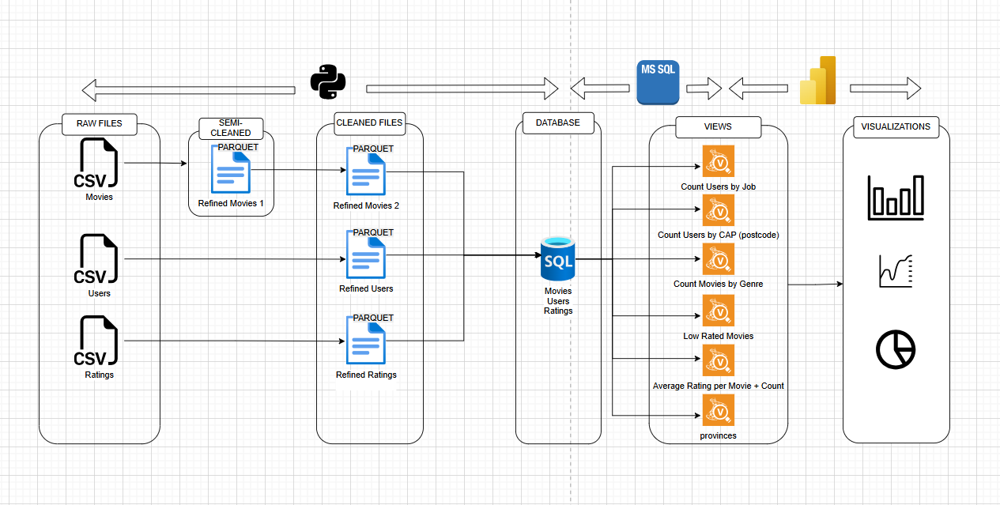

# Movie Data ETL Pipeline & Analytics Dashboard

## Project Overview

This group project implements a comprehensive **Extract, Transform, Load (ETL)** pipeline for movie rating data, transforming raw CSV files into a structured SQL database and creating interactive visualizations for data analysis. The pipeline processes movie, user, and ratings data to generate insights about viewing patterns, demographics, and movie performance.

---

## 🎯 Project Goals

- **Data Integration**: Consolidate movie, user, and ratings data from multiple CSV sources
- **Data Quality**: Clean and standardize data through multi-stage refinement
- **Database Design**: Create an optimized relational database structure with efficient views
- **Analytics**: Generate actionable insights through SQL views and interactive visualizations
- **Visualization**: Build comprehensive dashboards for exploring movie trends and user behavior

---

## 📊 Project Architecture



### Pipeline Stages

```
RAW FILES → SEMI-CLEANED → CLEANED FILES → DATABASE → VIEWS → VISUALIZATIONS
   (CSV)      (Parquet)      (Parquet)      (MySQL)   (MySQL)     (Power BI)
```

### 1. **Extract** - Raw Data Sources
Three primary CSV files containing:
- **Movies**: Movie metadata (title, genre, release year, etc.)
- **Users**: User demographics (age, gender, occupation, location)
- **Ratings**: User ratings for movies (user_id, movie_id, rating, timestamp)

### 2. **Transform** - Data Cleaning Pipeline

#### Stage 1: Semi-Cleaned Data (Parquet)
- Initial data validation
- Data type conversions
- Basic formatting standardization
- Output: `Refined Movies 1.parquet`

#### Stage 2: Cleaned Data (Parquet)
Three refined datasets:
- **Refined Movies 2**: Final movie data with cleaned titles, standardized genres
- **Refined Users**: Processed user data with age categories, validated demographics
- **Refined Ratings**: Cleaned rating records with validated foreign keys

### 3. **Load** - Database Implementation

#### Database Schema
The MS SQL database contains three main tables:
- `movies` - Movie information
- `users` - User demographics  
- `ratings` - Rating transactions

#### SQL Views
Six analytical views provide pre-aggregated insights:

1. **Count Users by Job**: Distribution of users across occupations
2. **Count Users by CAP (postcode)**: Geographic distribution of users
3. **Count Movies by Genre**: Movie catalog breakdown by genre
4. **Low Rated Movies**: Films with poor average ratings
5. **Average Rating per Movie + Count**: Movie performance metrics with rating counts
6. **provinces**: Geographic aggregation view

---

## 📂 Project Structure

```
movie_ETL/
├── raw_data/
│   ├── movies.csv
│   ├── users.csv
│   └── ratings.csv
├── semi_cleaned/
│   └── refined_movies_1.parquet
├── cleaned/
│   ├── refined_movies_2.parquet
│   ├── refined_users.parquet
│   └── refined_ratings.parquet
├── sql/
│   ├── on-the_movie.sql
│   ├── db_transformations.sql
├── visualizations/
│   ├── dashboard_1.png
│   ├── dashboard_2.png
│   └── dashboard_3.png
└── README.md

```

## 🛠️ Technologies Used

### Data Processing
- **Python**: ETL scripting and data transformation
- **Pandas**: Data manipulation and cleaning
- **The fuzz**: Checking for spelling errors

### Database
- **MySQL**: Relational database for structured storage
- **MySQL**: View creation and query optimization

### Visualization
- **Power BI**: Interactive dashboard creation
- **Geographic visualization**: Mapping user distribution

### File Formats
- **CSV**: Raw data input
- **Parquet**: Intermediate cleaned data storage

---

## 💡 Key Features

### Data Quality Improvements
- ✅ Duplicate removal
- ✅ Missing value handling
- ✅ Data type standardization
- ✅ Age category binning
- ✅ Genre normalization
- ✅ Foreign key validation

### Analytical Capabilities
- 📊 Movie performance metrics
- 👥 User demographic analysis
- 🗺️ Geographic distribution insights
- 📈 Temporal trend analysis
- 🎭 Genre popularity tracking
- 💼 Occupation-based segmentation

### Performance Optimizations
- 🚀 Parquet columnar storage
- 🔍 Indexed database views
- 📦 Pre-aggregated metrics
- ⚡ Efficient join operations

---

## 🔮 Future Enhancements

- [ ] Real-time data ingestion pipeline
- [ ] Machine learning recommendation system
- [ ] Sentiment analysis on user reviews
- [ ] A/B testing framework for recommendations
- [ ] API for external data access
- [ ] Automated data quality monitoring
- [ ] Time-series forecasting for trends
- [ ] Social network analysis of user behavior

---

## 👤 Author

**Michael Data**
- GitHub: [@michaeldata1](https://github.com/michaeldata1)
  

**Last Updated**: February 2026
