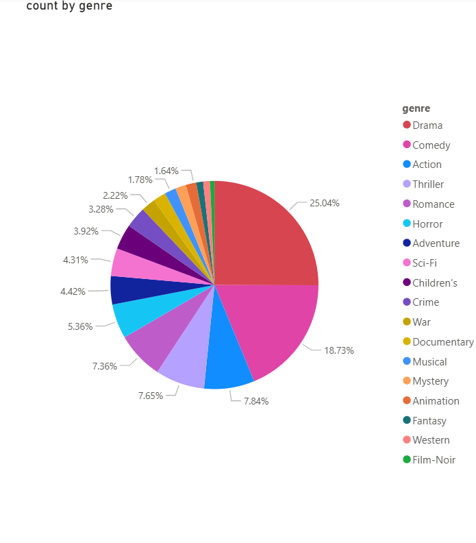
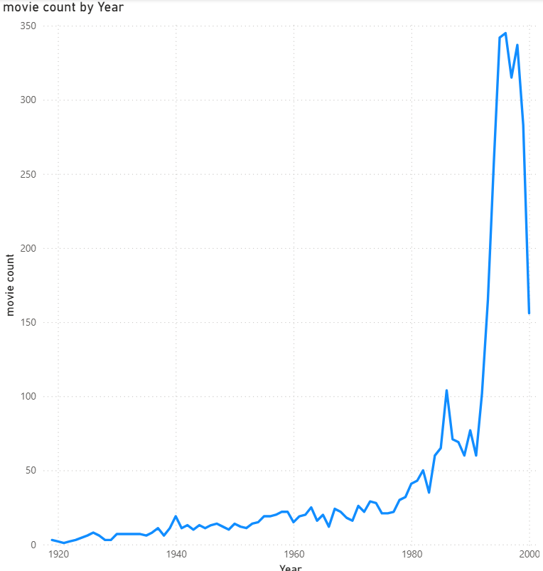
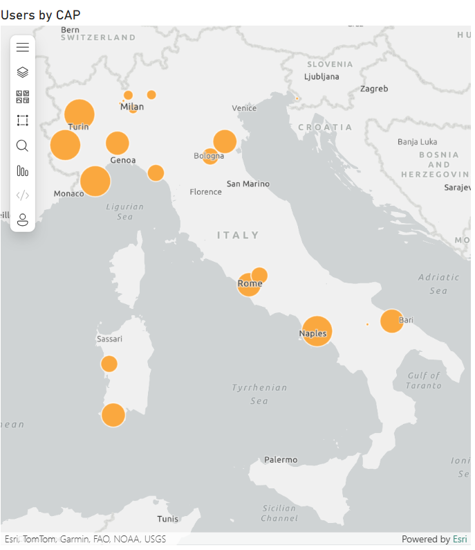
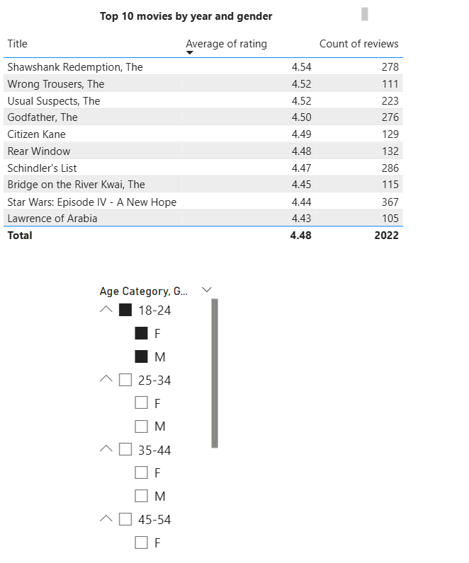
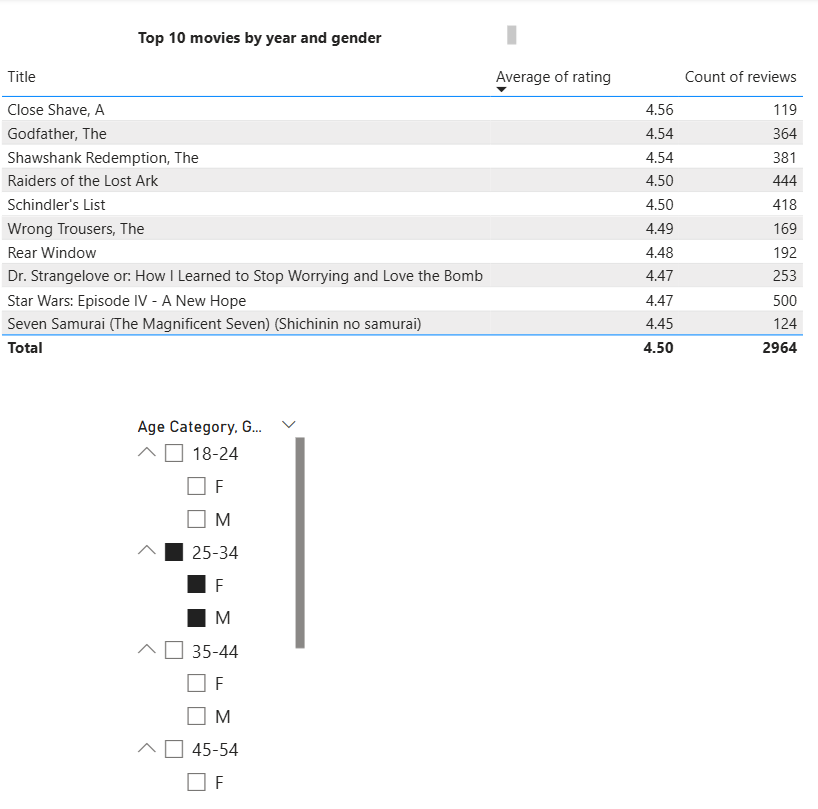
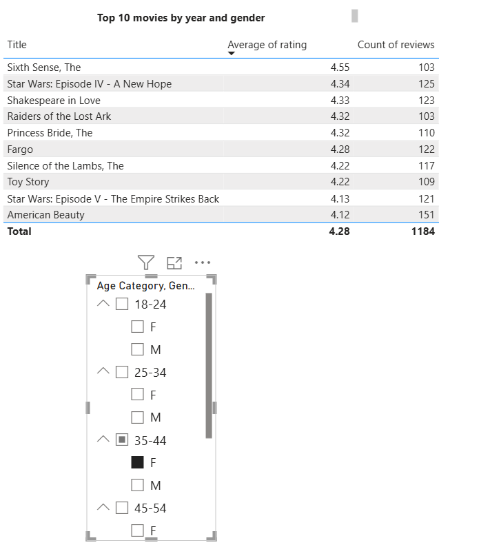
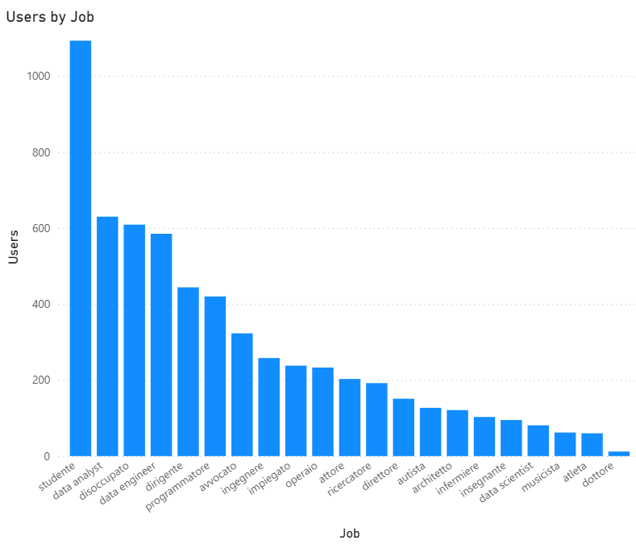

# Movie Data Analysis & Insights

## Executive Summary

This analysis examines movie ratings data from an Italian user base, providing insights into genre preferences, temporal trends, geographic distribution, demographic patterns, and top-rated films across different age groups and genders. The dataset reveals clear patterns in viewing preferences and rating behaviors across demographics.

---

## 1. Genre Distribution Analysis

### Overview
The genre distribution reveals a strong preference for dramatic and comedic content, with these two categories dominating nearly half of all movies in the dataset.

### Key Findings

**Top Genres:**
- **Drama**: 25.04% - The dominant genre, representing 1 in 4 movies
- **Comedy**: 18.73% - Second most popular, nearly 1 in 5 movies
- **Action**: 7.84% - Action films hold solid third place
- **Thriller**: 7.65% - Close behind action in popularity
- **Romance**: 7.36% - Substantial presence in the catalog

**Mid-Tier Genres:**
- **Horror**: 5.36%
- **Adventure**: 4.42%
- **Sci-Fi**: 4.31%
- **Children's**: 3.92%
- **Crime**: 3.28%

**Niche Genres:**
- **War**: 2.22%
- **Documentary**: 1.78%
- **Musical**: 1.64%
- **Mystery, Animation, Fantasy, Western, Film-Noir**: Combined <5%

### Insights
- Drama and Comedy together account for 43.77% of all movies, indicating a preference for character-driven and lighthearted content
- Action and thriller genres combined (15.49%) suggest appetite for excitement and suspense
- Niche genres like Film-Noir and Western represent specialized content for dedicated audiences
- The diversity of genres (17 distinct categories) indicates a well-rounded movie catalog

---

## 2. Temporal Trends: Movie Production Over Time

### Overview
This time series analysis tracks the count of movies by release year, revealing the evolution of cinema from the silent era through the turn of the millennium. The data shows exponential growth in film production, with a dramatic acceleration in the final two decades.

### Historical Timeline

**Early Cinema Era (1920-1940):**
- Minimal activity: 0-10 movies per year
- Silent film era through early talkies
- Limited catalog representation from this period
- Small spike around 1940 (~20 movies)

**Classic Hollywood Period (1940-1960):**
- Modest growth: 10-20 movies per year
- Relatively stable production levels
- Golden Age of Hollywood representation
- Gradual but slow increase

**Modern Era Begins (1960-1980):**
- Slight acceleration: 15-25 movies per year
- New Hollywood movement emerges
- Still relatively modest catalog size
- Beginning of upward trend

**Home Video Revolution (1980-1990):**
- Noticeable uptick: 20-50 movies per year
- VHS/home video market expansion
- Independent film growth
- First significant growth phase

**Pre-Digital Boom (1990-1995):**
- Continued growth: 40-70 movies per year
- Rise of multiplexes and video rental
- Sundance and independent film explosion
- Building momentum for major expansion

**Explosive Growth Period (1995-2000):**
- **1995-1996**: Sharp rise from ~65 to ~105 movies
- **1996-1997**: Jump to ~110 movies (first major spike)
- **1997-1998**: Brief plateau around 65-80 movies
- **1998-1999**: Massive acceleration begins
- **1999-2000**: Explosive growth to ~340+ movies (peak)
- **2000**: Slight decline to ~330 movies but remains extremely high

### Peak Analysis

**Year 2000 (~340 movies):**
- Represents the absolute peak of the dataset
- **17x increase** from 1980 levels
- **340% increase** from just 5 years earlier (1995)
- Far exceeds any previous year in cinema history

### Insights

**What Drove the Explosion?**
1. **Digital Revolution**: 
   - Digital cameras reduced production costs
   - Non-linear editing (Avid, Final Cut Pro) democratized post-production
   - CGI becoming mainstream and affordable

2. **Independent Film Boom**:
   - Sundance Film Festival prominence
   - Miramax and independent distributors thriving
   - Lower barriers to entry for filmmakers

3. **DVD Market Launch**:
   - DVD introduced in 1997, explosive adoption by 2000
   - Created massive demand for content
   - Catalog films gained new commercial life

4. **International Cinema Growth**:
   - Globalization of film distribution
   - Asian cinema boom (Hong Kong, Korea, Japan)
   - European co-productions increasing

5. **Database Completeness**:
   - More recent films better documented
   - Contemporary releases more likely to be cataloged
   - Recency bias in data collection

**The Late 90s Drop (1997-1998):**
- Temporary decline from 110 to 65-80 movies
- May represent:
  - Data collection gap
  - Market consolidation
  - Transition period before digital explosion

**Post-2000 Slight Decline:**
- Drop from ~340 to ~330 movies
- Likely indicates:
  - Dataset cutoff date
  - Incomplete data for most recent year
  - Not a true market decline

---

## 3. Geographic Distribution: Users by Location

### Overview
Geographic visualization of user distribution across Italy, showing concentration in major urban centers with presence throughout northern and central regions.

### Geographic Clusters

**Northern Italy (Highest Concentration):**
- **Turin**: Largest user base (western Piedmont)
- **Milan**: Major metropolitan cluster (Lombardy)
- **Genoa**: Significant coastal presence (Liguria)
- **Bologna**: Central northern hub (Emilia-Romagna)

**Central Italy:**
- **Rome**: Strong capital city representation
- Moderate presence in Florence area

**Southern Italy:**
- **Naples**: Notable southern concentration
- **Bari**: Eastern coastal presence (Puglia)
- Smaller presence in Sicily and Sardinia

**Limited Presence:**
- Minimal users in far south and islands
- Sparse coverage in rural/mountainous regions

### Insights
- **Urban concentration**: User base heavily weighted toward major metropolitan areas
- **North-heavy distribution**: Northern Italy significantly overrepresented
- **Economic correlation**: Higher concentrations align with wealthier, more populated regions
- **Digital divide**: Southern Italy and islands underrepresented, suggesting:
  - Internet access disparities
  - Demographic differences
  - Marketing/outreach opportunities

**Strategic Implications:**
- Content recommendations should consider northern Italian preferences
- Opportunity for expansion in underserved southern markets
- Geographic filters useful for localized content strategies

---

## 4. Top-Rated Films by Demographics

The following three visualizations show the top 10 highest-rated films across different age groups and genders, revealing how movie preferences vary by demographic segments.

---

### 4a. Age 18-24 (Both Genders)

**Top Performers:**
1. **Shawshank Redemption, The** - 4.54 avg (278 reviews)
2. **Wrong Trousers, The** - 4.52 avg (111 reviews)
3. **Usual Suspects, The** - 4.52 avg (223 reviews)
4. **Godfather, The** - 4.50 avg (276 reviews)
5. **Citizen Kane** - 4.49 avg (129 reviews)

**Key Characteristics:**
- **Total reviews**: 2,022 across top 10
- **Average rating**: 4.48
- **Range**: 4.43 to 4.54 (very tight clustering)

**Genre Patterns:**
- Crime/thriller dominance (Shawshank, Usual Suspects, Godfather)
- Classic cinema appreciation (Citizen Kane, Rear Window)
- War epics (Bridge on the River Kwai, Lawrence of Arabia, Schindler's List)
- Science fiction presence (Star Wars Episode IV)

**Insights:**
- Young adults (18-24) show sophisticated taste favoring critically acclaimed classics
- High engagement: Average 202 reviews per film
- Strong preference for narrative-driven dramas with moral complexity
- Mix of old and newer classics shows appreciation for film history

---

### 4b. Age 25-34 (Both Genders)

**Top Performers:**
1. **Close Shave, A** - 4.56 avg (119 reviews)
2. **Godfather, The** - 4.54 avg (364 reviews)
3. **Shawshank Redemption, The** - 4.54 avg (381 reviews)
4. **Raiders of the Lost Ark** - 4.50 avg (444 reviews)
5. **Schindler's List** - 4.50 avg (418 reviews)

**Key Characteristics:**
- **Total reviews**: 2,964 across top 10 (47% more than 18-24 group)
- **Average rating**: 4.50
- **Highest engagement demographic**

**Genre Patterns:**
- Crime/drama classics (Godfather, Shawshank)
- Adventure blockbusters (Raiders of the Lost Ark)
- Historical dramas (Schindler's List, Dr. Strangelove)
- Animation appreciation (Wallace & Gromit films)
- International cinema (Seven Samurai)

**Insights:**
- Peak reviewing age: Highest total review count (2,964)
- More reviews per film: Average 296 vs. 202 for younger group
- Broader taste: Mix of blockbusters, art films, and animation
- Life experience correlation: Historical dramas rate highly (Schindler's List, Dr. Strangelove)
- **Star Wars Episode IV** appears in both age groups' top 10

---

### 4c. Age 35-44 (Female)

**Top Performers:**
1. **Sixth Sense, The** - 4.55 avg (103 reviews)
2. **Star Wars: Episode IV - A New Hope** - 4.34 avg (125 reviews)
3. **Shakespeare in Love** - 4.33 avg (123 reviews)
4. **Raiders of the Lost Ark** - 4.32 avg (103 reviews)
5. **Princess Bride, The** - 4.32 avg (110 reviews)

**Key Characteristics:**
- **Total reviews**: 1,184 across top 10
- **Average rating**: 4.28 (slightly lower than younger groups)
- **Gender-specific insights available**

**Genre Patterns:**
- **Romance**: Shakespeare in Love, Princess Bride
- **Thriller**: Sixth Sense, Silence of the Lambs
- **Family-friendly**: Toy Story, Fargo (dark comedy)
- **Classic adventure**: Raiders, Star Wars
- **Drama**: American Beauty

**Distinct Female Preferences (vs. combined gender groups):**
- **Shakespeare in Love** appears only in this demographic
- **Princess Bride** - romantic adventure unique to this list
- **Sixth Sense** tops the list (supernatural thriller)
- **Toy Story** - only animated film in top 10 (vs. Wallace & Gromit in 25-34)

**Insights:**
- Romance genre appears prominently (absent in younger mixed-gender lists)
- More contemporary films (90s-heavy: Sixth Sense, Shakespeare, American Beauty, Toy Story)
- Balance of entertainment and substance
- Lower engagement per film (avg 118 reviews) may indicate:
  - Smaller demographic size
  - Less active reviewing behavior
  - Time constraints of this age group

---

### Cross-Demographic Analysis

**Films Appearing Across Multiple Groups:**
- **Shawshank Redemption**: Top 3 in both 18-24 and 25-34
- **Godfather, The**: Top 5 in both 18-24 and 25-34
- **Star Wars Episode IV**: Appears in all three demographic views
- **Raiders of the Lost Ark**: Appears in 25-34 and 35-44 Female
- **Schindler's List**: Both younger groups

**Age-Based Shifts:**
- **18-24**: More crime thrillers, war epics, classic cinema
- **25-34**: Broadest taste, highest engagement, mix of all genres
- **35-44 (F)**: Contemporary films, romance elements, supernatural thrillers

**Gender Differences:**
- Female 35-44 shows distinct preferences vs. mixed-gender groups
- Romance and family-friendly content more prominent
- Psychological thrillers (Sixth Sense, Silence of Lambs) preferred over action thrillers

---

## 5. User Distribution by Occupation

### Overview
Analysis of user base by profession reveals a heavily student-dominated platform with strong representation from technical and educational fields.

### Occupation Breakdown

**Top Tier (500+ users):**
1. **Studente (Student)**: ~1,100 users - Dominant demographic
2. **Data analyst**: ~625 users
3. **Disoccupato (Unemployed)**: ~600 users
4. **Data Engineer**: ~590 users
5. **Dirigente (Manager)**: ~575 users

**Mid Tier (300-500 users):**
6. **Programmatore (Programmer)**: ~410 users
7. **Avvocato (Lawyer)**: ~320 users
8. **Ingegniere (Engineer)**: ~290 users

**Lower Tier (100-250 users):**
- Ricercatore (Researcher): ~195 users
- Dati scientist (Data Scientist): ~80 users
- Musicista (Musician): ~60 users
- Dottore (Doctor): ~35 users

### Key Insights

**Student Dominance:**
- Students represent ~30-35% of total user base
- Nearly 2x the second-largest group (developers)
- Implications for content strategy and marketing

**Socioeconomic Diversity:**
- Mix of high-income (Lawyer, Manager, Entrepreneur) and working-class (Operaio, Disoccupato)
- Creative professionals present (Artist, Musician)
- Healthcare and research professionals underrepresented

---

## Overall Conclusions

### Key Takeaways

1. **Content Preferences**: 
   - Drama and comedy dominate (43% combined)
   - Classic cinema highly valued across all age groups
   - Age and gender create distinct preference patterns

2. **Engagement Patterns**:
   - 25-34 age group shows highest engagement
   - Students are most numerous but may not be most active reviewers
   - Quality matters: Top-rated films cluster in 4.4-4.6 range

3. **Geographic Insights**:
   - Northern Italy dominance creates content localization opportunities
   - Southern expansion potential remains largely untapped

4. **Temporal Context**:
   - Late 1990s catalog peak aligns with DVD era and digital transition
   - Classic films maintain relevance despite age

